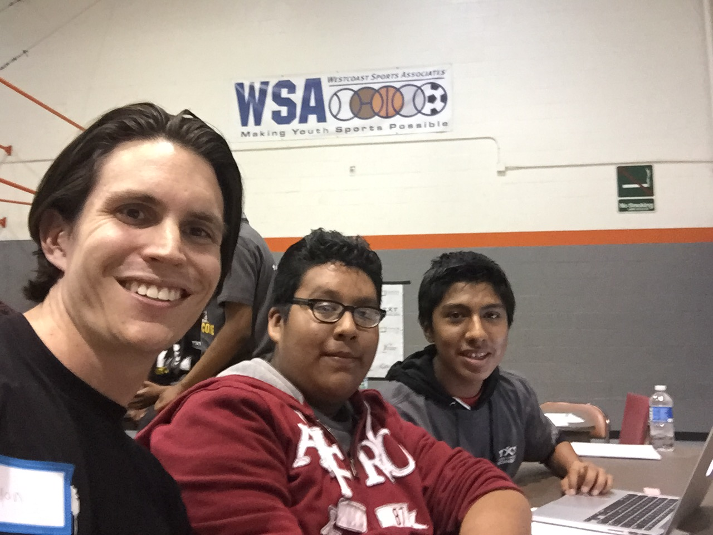

# TxT Hackathon 2015
## Team: BlackOps ( Eddie, Jonathan, and Jose )
### Say No To Drugs Website

This website was designed an built in one day by three JR High/High School Students students at the TxT South Los Angeles Hackathon. At the beginning of the day, these students had little to no experience with HTML or CSS but were able to pick it up quickly. The goal of this hackathon was to find and problem in the community and code a web page that might help mitigate this problem.

Team BlackOps decided that one of the biggest problems they found in their community was drug dealers and high schoolers doing drugs. They decided to code up a web site that showed information about different kinds of drugs in an effort to spread awareness of how deadly addictive drug use can be.

